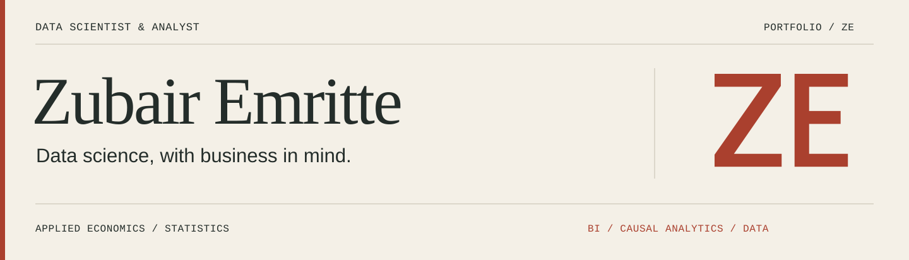
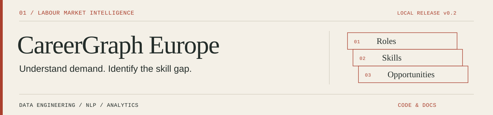
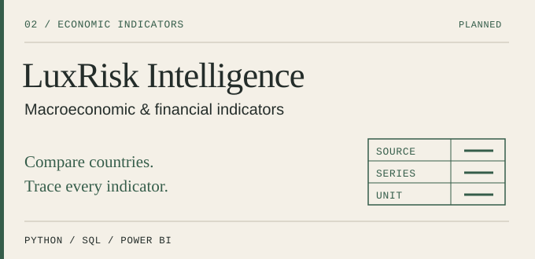
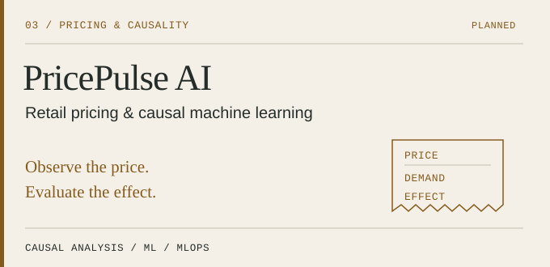
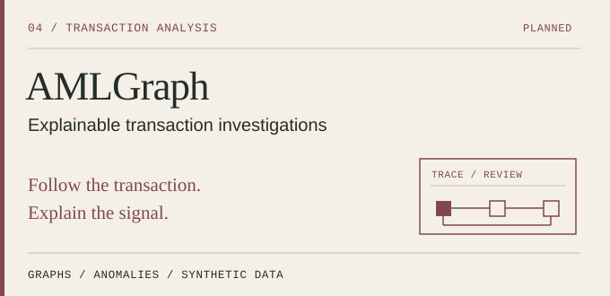
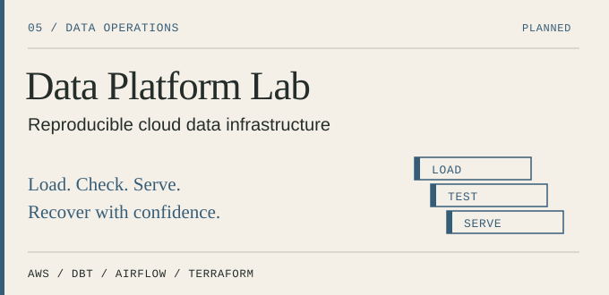

<picture>
  <source media="(max-width: 600px)" srcset="assets/identity/hero-compact.svg">
  
</picture>

  <a href="https://www.linkedin.com/in/zubair-emritte"><strong>LinkedIn</strong></a> &nbsp; / &nbsp;
  <a href="mailto:zubairemritte@gmail.com"><strong>Contact</strong></a> &nbsp; / &nbsp;
  <a href="#projects"><strong>Projects</strong></a>

## Turning data into decisions people can act on

I'm **Zubair**, a data scientist and analyst with a background in **applied economics and statistics**. My experience spans retail pricing, financial controls, BI and cloud analytics. I connect the business question to the data, the method and the explanation that makes the result useful.

| Analyse & explain | Build reliable data | Support decisions |
| :--- | :--- | :--- |
| Causal inference, statistical modelling, machine learning | Python / SQL pipelines, quality controls, GCP | Power BI, financial analytics, pricing insights |

## Experience behind the work

**Esya Conseil · Data Analyst, Finance & Data Quality** &nbsp; `Sep 2025–Sep 2026`  
Worked on multi-source reconciliations, financial reporting and anomaly detection across invoicing, payments and accounting data. Automated controls and consolidations with **SQL, Python, Power Query and Power BI** to make reporting more reliable and traceable.

**Carrefour · Data Scientist, Pricing & Causal Analytics** &nbsp; `Sep 2024–Sep 2025`  
Evaluated the effect of price changes using Bayesian Causal Impact and clustered control stores. Built reproducible analytical pipelines and monitored data, prediction and attribution drift with **Vertex AI and BigQuery** to support pricing decisions.

**Checkout · Data Analyst, BI & Automation** &nbsp; `Jul 2022–Aug 2023`  
Built multi-source ETL workflows, **Power BI models and DAX measures**, with checks for duplicates, missing values and inconsistencies, to support performance reporting.

<strong>Earlier experience & academic foundation</strong>

- **DEPP, French Ministry of Education · Mar–Jun 2022** — Data preparation, descriptive and multivariate analysis, factor analysis and clustering for statistical studies.
- **CNP Assurances · Oct 2021–Mar 2022** — SAS automation for accounting data, table preparation and reusable macros.
- **Master's in Applied Economics — Data Science, UPEC · 2025** — Graduated with *high honours*.
- **BSc-level degree in Economics & Information Processing, UPEC · 2023**, following a **University Diploma of Technology (DUT) in Statistics & Business Intelligence · 2022**, *high honours*.
- Academic work includes **credit scoring & ESG econometrics** and **spatial analysis & causal methods**.

## Projects

Five independent data products exploring labour markets, financial indicators, pricing, transaction networks and reliable infrastructure. **CareerGraph Europe has a working local first release.** The other four projects have product briefs; implementations will follow one at a time.

**CareerGraph Europe** — Which additional skill would cover more of the detected skill sets in an observed job sample? A working local application with European country filters, traceable skill mentions, collection audits and separate official economic context. Live offer coverage is explicitly reported.  
**Implemented:** Python · SQL · SQLite · FastAPI · Poetry · typed connectors · traceable skill extraction  
[Read the project overview →](docs/projects/careergraph-europe.md) · [Explore the code and documentation →](https://github.com/zubairemritte/careergraph-europe)

<table>
<tr>
<td width="50%" valign="top">

<strong>LuxRisk Intelligence</strong> Traceable economic indicators, country comparisons and scenario analysis for financial decision support.

<strong>Focus:</strong> Python · SQL · Power BI · forecasting

<a href="docs/projects/luxrisk-intelligence.md">Read the brief →</a>
</td>
<td width="50%" valign="top">

<strong>PricePulse AI</strong> Price intelligence, demand modelling and carefully evaluated causal analysis, connected to model monitoring.

<strong>Focus:</strong> causal inference · ML · MLflow · GCP

<a href="docs/projects/pricepulse-ai.md">Read the brief →</a>
</td>
</tr>
<tr>
<td width="50%" valign="top">

<strong>AMLGraph</strong> Transaction-network analysis and prioritised alerts, with an investigation view explaining each signal.

<strong>Focus:</strong> graph analytics · anomaly detection · synthetic data

<a href="docs/projects/amlgraph.md">Read the brief →</a>
</td>
<td width="50%" valign="top">

<strong>Data Platform Lab</strong> A reproducible data platform with tested transformations, orchestration, lineage and operational runbooks.

<strong>Focus:</strong> AWS · dbt · Airflow · Terraform

<a href="docs/projects/data-platform-lab.md">Read the brief →</a>
</td>
</tr>
</table>

## My working toolkit

| Area | Tools and methods used in my work or studies |
| :--- | :--- |
| **Programming & analysis** | Python, SQL, pandas, R, SAS, statistics, econometrics |
| **BI & business reporting** | Power BI, DAX, Power Query, Excel, Looker Studio |
| **Data science** | Machine learning, clustering, causal inference, model evaluation |
| **Cloud & pipelines** | GCP, BigQuery, Vertex AI, Cloud Storage, Compute Engine, Kubeflow |
| **Reproducibility & quality** | Git / GitLab, Poetry, automated pipelines, reconciliation and data-quality controls |

## How I approach a project

**A clear business question. Reproducible code. Evidence you can inspect.**

- Documented data sources, definitions and limitations.
- Tested transformations and a reproducible execution path.
- Baselines, evaluation methods and measured results.
- A usable demonstration, with deployment and operating instructions.
- Architecture decisions and a concise explanation for technical and business audiences.

## Let's talk data

For **data projects, technical discussions or professional opportunities**, get in touch. My work connects analytical rigour, reliable workflows and business understanding.

**[Connect on LinkedIn](https://www.linkedin.com/in/zubair-emritte)** · **[Email me](mailto:zubairemritte@gmail.com)**

Independent portfolio projects · Company experience summarised without proprietary code or data.
