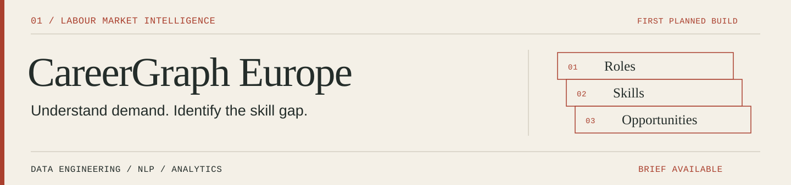

[← Profile](../../README.md) · [All projects](../README.md)

# CareerGraph Europe

**Job market & skills intelligence**  
**Status:** first planned build; [repository initialized](https://github.com/zubairemritte/careergraph-europe). The capabilities below are the product scope, not an available demo.

## The business question

A candidate sees hundreds of job titles, inconsistent skill descriptions and uneven salary information. Which skills are repeatedly requested for a target role, and which opportunities deserve closer attention?

The product will help candidates and analysts explore the **observed job market**, with explicit coverage limits for each source, country and period.

## The intended user journey

1. Choose a country, role family, location and contract type.
2. Inspect employer demand, frequently co-occurring skills and available salary information.
3. Open the underlying offers and see the source, collection date and normalised fields.
4. Optionally compare a CV's extracted skills with the selected offer set.
5. Review the matched evidence, missing skills and suggested learning priorities.

## Professional features in scope

- **Source-aware ingestion:** connector configuration, pagination, retries, rate-limit handling and incremental collection.
- **Historical analysis:** dated snapshots, offer identifiers, deduplication and an explicit policy for updates and expired offers.
- **A useful data model:** offers, sources, employers, locations, role families, skills and collection runs; analytical tables for market summaries.
- **Multilingual skill extraction:** a documented vocabulary and aliases, with an annotated evaluation sample before introducing more complex NLP.
- **Skill relationships:** co-occurrence counts, denominators and minimum sample sizes, so rare pairs do not dominate the graph.
- **Explainable CV comparison:** visible matched evidence and editable extracted skills. Scores describe coverage of a defined offer sample.
- **Useful BI:** country / role filters, data freshness, completeness indicators and source drill-down.
- **Operational visibility:** run logs, failed-source reporting, quality checks and a reproducible deployment path.

## Proposed architecture

Python connectors collect source records into raw storage. SQL / dbt transformations create clean analytical tables in BigQuery. Airflow is a candidate orchestrator once scheduled dependencies justify it. A FastAPI layer and a dashboard expose the market analysis and optional CV comparison.

Docker, GitHub Actions and infrastructure configuration are planned for reproducible delivery. An initial local execution path will make development and demonstrations possible before cloud deployment.

## Data and access decisions to resolve first

France Travail is the first candidate source for French job offers. The Luxembourg source must be validated separately for coverage, access, licensing and permitted reuse; an openly visible website is not assumed to provide a reusable API. Each connector will record what it can actually collect.

Salary figures will retain currency, period and whether they were explicitly stated. Missing salaries will not become zero. Market comparisons will explain source and sampling differences. Uploaded CVs will not be committed to the repository; the initial design should avoid retaining them by default.

## Evaluation and release evidence

| Area | Evidence to produce |
| --- | --- |
| Ingestion | Repeatable runs, deduplication checks, source counts, failures and freshness |
| Skill extraction | Precision / recall on a documented, manually reviewed sample |
| Market analysis | Counts, denominators, time range and source coverage for each view |
| CV comparison | Tests for score calculation and explanations linked to the extracted evidence |
| Product | A reproducible demonstration of one complete country / role analysis and a labelled sample CV |

**First release boundary:** a working path from an authorised source to a validated market view. A France-only working slice may precede verified Luxembourg coverage; country labels will reflect the actual data available.
